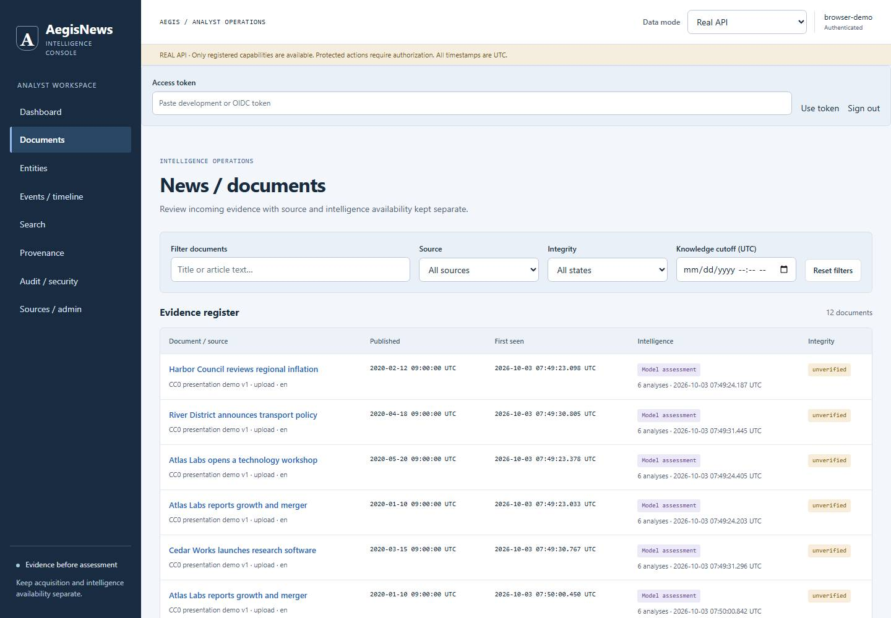
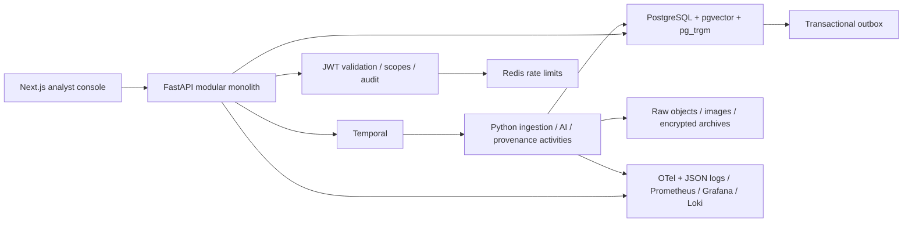
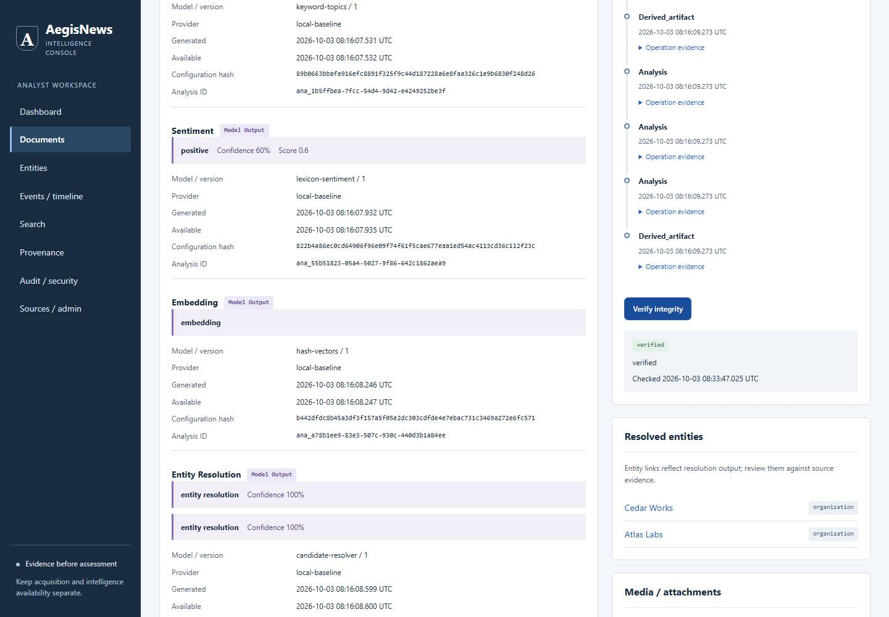

# AegisNews

**Secure multimodal news intelligence, with evidence you can inspect.**

AegisNews turns historical/local articles and linked media into normalized documents,
versioned AI analyses, entity/event evidence and signed provenance. This working
academic prototype combines AI, Information Security, Cryptography and Multimedia.
It makes source evidence, model predictions, availability and tampering visible.
A signature does not establish source truth or model correctness.

The integrated MVP is frozen at **`v0.1.0-mvp`**. **`v0.2.0-evaluation`** preserves
the earlier evaluation/demo release. `main` includes the subsequent Gold v3 and
CPU/GPU evidence and is the common baseline for future work.
[MVP release record](docs/mvp-release.md).



## Implemented now

- Authenticated local/historical ingestion through a real Temporal workflow.
- MinIO raw objects, normalized PostgreSQL documents and explicit image/media links.
- Offline entities/topics/sentiment/embeddings/resolution/events; optional local models.
- Immutable analyses with model/configuration/availability lineage; transactional outbox.
- Scope-authorized APIs, explicit development identity and persistent security audit.
- SHA-256 integrity, AES-256-GCM encrypted archives, Ed25519 signatures and tamper detection.
- Real document/entity/event/search/source/audit dashboard, plus explicit mock mode.
- OpenAPI-derived TypeScript types, deterministic demo reset/seed and measured evaluation.
- OTel context, Prometheus, provisioned Grafana dashboard and Loki/Alloy logs.

## Architecture and stack



Python 3.12+, FastAPI, Pydantic, SQLAlchemy/Alembic; Temporal; PostgreSQL; Redis;
S3/MinIO; Next.js/React/TypeScript; standard `cryptography`; OpenTelemetry/Prometheus/
Grafana/Loki/Alloy. Tooling: uv, pnpm, Ruff, strict mypy, pytest and Playwright.
Modular monolith plus workers, local first. [Detailed diagrams](docs/phase6/architecture-diagrams.md).

## Quickstart

Prerequisites: Git, Docker Engine/Desktop with Compose v2 and Python 3.12+ for the
portable helper. No GPU, host ML installation, paid API or model download is needed.
The first build includes source-built MinIO and may take longer.

```sh
git clone https://github.com/itsmanudon/aegis-news.git
cd aegis-news
python scripts/demo.py start
python scripts/demo.py token --role analyst
```

Open [dashboard](http://localhost:33000), paste the token into **Access token**, and
click **Use token**. Tokens expire after five minutes; generate a fresh one as needed.
Use `--role admin` for writes and `--role viewer` for insufficient-scope demonstrations.
Tokens stay in browser memory. This is explicit local identity, not a production issuer.

The helper starts an isolated `aegis-demo` stack and seeds five original synthetic
articles, including an original PNG. It uses supplied alternate loopback ports in
`infrastructure/demo.env.example`. Copy `.env.example` to `.env` only for separate host
development; the helper uses its own environment file.

Docker-only alternative, without host Python:

```sh
docker compose --env-file infrastructure/demo.env.example -p aegis-demo --profile full up --build -d --wait
docker compose --env-file infrastructure/demo.env.example -p aegis-demo exec -T api python -m scripts.demo_seed
docker compose --env-file infrastructure/demo.env.example -p aegis-demo exec -T api python scripts/security_dev.py token --key-id local --role analyst --subject local-demo
```

`python scripts/demo.py reset` deletes only this local project's volumes, regenerates
keys and reseeds. Logical content stays fixed; UUIDs/timestamps change. `stop` retains
data. Windows uses `python`/`pnpm.cmd`; macOS/Linux may use `python3`/`pnpm`.
[5–8 minute demo, reset and platform guide](docs/phase6/demo-guide.md).

## Evaluation and performance

The [CC0 Gold v3 Human set](ml/datasets/gold/README.md) is the canonical small reviewed
evaluation reference. It has 16 short English cases
across eight categories, independently reviewed by one human. All v2 labels were
accepted: zero human corrections. Original provisional/agent-adjudicated sets and
historical results remain preserved. This small corpus does not establish real-news quality.

Fresh Offline, pretrained Light CPU and RTX 4070 CUDA runs use identical scoring,
texts and pinned model revisions. CPU/GPU categorical predictions and metrics match.

| Task | Offline v3 | Light CPU v3 | Light GPU v3 |
|---|---:|---:|---:|
| Exact NER span F1 | 0.970 | 0.970 | 0.970 |
| Typed NER F1 | 0.000 | 0.970 | 0.970 |
| Topic macro F1 | 0.667 | 0.667 | 0.667 |
| Sentiment macro F1 | 0.390 | 0.491 | 0.491 |
| Event extraction F1 | 0.818 | 0.818 | 0.818 |
| Resolution accuracy, gold mentions/tiny supplied candidates | 1.000 | 1.000 | 1.000 |
| Coarse paired-document retrieval MRR | 0.199 | 0.809 | 0.809 |

Light uses BERT NER, FinBERT sentiment and MiniLM embeddings; topics/events/resolution
remain baselines. Both profiles miss all three mixed-sentiment cases. Warm seven-task
medians were 3.47/140.58/62.65 ms (Offline/CPU/GPU); GPU peak allocated VRAM was 975 MiB.
Warm complete five-item Temporal workflow medians were 2.643/2.564/1.834 s. The tiny
batch and uncontrolled workload prevent a production-scale performance claim.
Full remains unbenchmarked. [Gold v3 methods/errors/resources](docs/evaluation/gold-v3-gpu.md),
[presentation tables](docs/evaluation/evidence/gold-v3/comparison.md),
[optional local reproduction](docs/evaluation/gold-v3-reproduce.md),
[validation ledger](docs/evaluation/gold-v3-validation.md).

```sh
uv sync --frozen
uv run python -m scripts.evaluate_reviewed --profile offline --output .evaluation-tmp/gold-v3-offline.json
python scripts/demo.py benchmark
python scripts/demo.py security
python scripts/demo.py reliability
python -m scripts.demo_observability
```

## Security and provenance

SHA-256 hashes content; AES-GCM encrypts selected stored archives; Ed25519 signs
canonical lineage. TLS is separate transport protection; the loopback demo uses HTTP.
Keys are generated in a private volume, never Git. Trusted issuers/public keys and
SQL/key administrators remain important trust boundaries.



The automated suite checks authentication/scopes/denial; raw/SQL/image tampering;
AES decryption/ciphertext rejection; signatures/modified content; audit and redaction.
Controlled changes are restored. [Threat model and crypto explanation](docs/phase6/security-and-crypto.md).
This is internal signed provenance, not production C2PA or external trusted timestamping.

## API, repository and academic evidence

[Local OpenAPI/Swagger](http://localhost:38000/docs), [API examples](docs/phase6/api-guide.md),
[endpoint inventory](docs/mvp-integration.md). Exported schemas drive frontend types.

| Path | Responsibility |
|---|---|
| `apps/api`, `apps/worker`, `apps/web` | Process entrypoints and dashboard |
| `aegis/` | Domain/contracts and bounded application modules |
| `ml/` | Local model guidance, gold set and evaluation reports |
| `migrations/`, `schemas/` | SQL history and exported contracts |
| `scripts/`, `infrastructure/` | Reproducibility and local runtime/monitoring |
| `tests/` | Unit/contract/security/ingestion and real infrastructure seams |
| `docs/`, `data/samples/` | Runbooks, academic evidence and original synthetic media |

[Screenshots](docs/evidence/README.md), [presentation outline and rubric mapping](docs/phase6/presentation-outline.md),
[validation record](docs/phase6/validation.md), [ADRs](docs/adr/README.md).
Normal CI stays CPU/offline without cloud credentials/heavy models; extended Docker/browser
acceptance is manual. Exact executed counts, hosted URLs and warnings are in the validation record.

## Limitations and future roadmap

Uncalibrated offline rules, small synthetic English set with only one human reviewer; exact
similarity scan, curated entity candidates and incomplete mutable-registry/link history.
The dashboard shows real media metadata; authorized inline preview remains unavailable.
The OTel collector debug-exports traces without durable trace storage/UI.

Next: a separately planned licensed real-world held-out evaluation corpus and focused
usability/reliability improvements. Kafka, OpenSearch, Kubernetes, cloud deployment,
Stockwise/backtester/portfolio/ticker integration and production C2PA are future ideas,
not implemented capabilities. No trading signals or financial execution logic is present.
