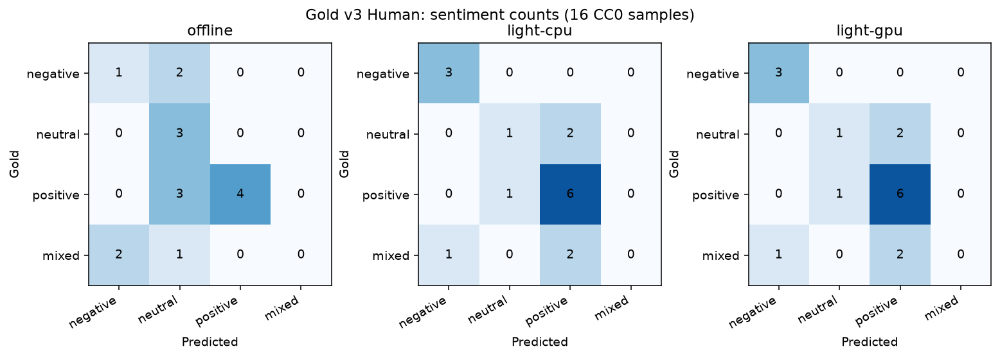

# Gold v3 Human: validation and RTX 4070 evaluation

Date: 2026-10-03. Authoritative main base: `3c563a72a1c80fe50fe1fbdad25e69e8e7dfac0c`.
Evaluation working base: `175d71b188bcde06bd7730e20ea14b3235753756`.
Branch: `eval/human-review-light-models`. No main merge, rebase, or release tag.

## Human review and immutable inputs

The user independently reviewed all 16 cases in
[assessment-v3-human.json](../../ml/datasets/gold/assessment-v3-human.json).
Every block has `status: reviewed`, empty `changes`, and an unchanged original-label
snapshot. Zero human label changes occurred from v2 to v3. All original documents,
17 exact entity spans/types/resolution targets, candidate lists, 12 event annotations,
retrieval partners and two media references are preserved. The initial validation found
two pending statuses; execution waited until the user marked both reviewed.

One human reviewer accepted the existing agent-adjudicated labels. This is not a
multi-reviewer consensus or a new large held-out dataset. Historical `annotation_note`
text remains agent-authored context. The agent checked structure, not semantic correctness.
[Manifest](../../ml/datasets/gold/manifest-v3-human.json) records exact UTF-8/LF SHA-256,
byte sizes, review method/status/count, source version, license and generation time.
Original v1/v2, prior review records/manifests and historical measured reports are intact.

## Same scoring and models

All three fresh quality passes use the existing `assess` implementation and one quality
round. Its optional engine argument selects the device; no metric definition changed.
The reviewed loader validates status/change-log consistency before projecting the review
metadata out of the unchanged assessment contract. Dataset raw-file and canonical hashes
are recorded. Topics/events use the same frozen keyword rules; resolution uses gold
mentions and small supplied candidate sets. Exact-span/type NER, observed-label-union
macro F1, exact sentence/type event extraction and stable self-excluding retrieval are
unchanged. Mixed sentiment remains in gold even though FinBERT has only three classes.

| Pretrained model | Immutable revision | Verified selected payload |
|---|---|---:|
| dslim/bert-base-NER | `d1a3e8f13f8c3566299d95fcfc9a8d2382a9affc` | 434,391,621 bytes |
| ProsusAI/finbert | `4556d13015211d73dccd3fdd39d39232506f3e43` | 438,225,383 bytes |
| sentence-transformers/all-MiniLM-L6-v2 | `1110a243fdf4706b3f48f1d95db1a4f5529b4d41` | 91,607,178 bytes |

The three cached snapshots were rehashed against the historical artifact receipt:
964,224,182 bytes total (919.6 MiB), including its previously selected auxiliary files.
No model weights were downloaded in this phase. This is logical selected payload,
not filesystem allocation/whole-cache size. No weights/caches/binaries are committed.

[Measured quality, runtime and pipeline tables](evidence/gold-v3/comparison.md),
[CPU/GPU output comparison](../../ml/evaluation/results/gold-v3-device-consistency.json),
[hardware and artifact verification](../../ml/evaluation/results/gold-v3-environment.json).

## CPU versus CUDA

Windows 11; Intel Core i9-14900HX, 24 physical/32 logical CPUs; 34,053,414,912 bytes RAM;
Python 3.12.11. CPU environment retains torch 2.14.1+cpu. A separate ignored local GPU
environment uses the official torch 2.14.1+cu130 build, CUDA runtime 13.0, driver 610.74,
and NVIDIA GeForce RTX 4070 Laptop GPU (8188 MiB). CUDA tensor execution was verified
before inference. Transformers 4.57.6, sentence-transformers 3.4.1, huggingface-hub 0.36.2,
psutil 7.2.2 and existing remaining pinned packages are retained. CPU defaults use 24
torch threads; no thread/precision/batch/threshold tuning was performed.

BERT NER, FinBERT and MiniLM all report loaded device `cuda:0` in GPU performance evidence.
Effective predictions, complete quality metrics and top-three retrieval rankings match CPU.
Maximum absolute numeric output difference is approximately 6.33e-6 (tolerance 1e-5),
covering confidences, sentiment scores and all embedding components. This is floating-point
execution variation, not quality improvement.

Process-cold document, per-task loading and steady-state timing are separate. GPU torch
import/device verification takes 2824.85 ms before the timed cold document (7063.85 ms);
combined device preparation plus cold document is 9888.70 ms. CPU cold is 12965.67 ms.
These are single cold samples, not stable startup distributions, and exclude interpreter
startup, downloads/install, CUDA wheel extraction and disk-cache flushing.

After a full unmeasured 16-document warmup, three identical sequential seven-task rounds
produce 48 timings per profile. CUDA synchronizes before/after each task. Warm medians
are 3.47 ms Offline, 140.58 ms Light CPU, 62.65 ms Light GPU. GPU throughput is about
2.14 times CPU in this run. Transformers warns that GPU batching could be more efficient;
batching was deliberately unchanged for a fair device comparison.

RSS polling every 20 ms is a sampled process peak, not a guaranteed native peak. PyTorch
records allocated/reserved and peak VRAM plus post-cold and steady-state residency.
Peak allocated GPU VRAM is 975 MiB; reserved memory is reported separately. Utilization
was not isolated from display/other background applications, so no attributable GPU-utilization
percentage is asserted. The CUDA wheel installer reported approximately 1.9 GiB download;
wire bytes and the complete package-environment disk footprint were not instrumented.

## Full workflow protocol

The final comparison uses an isolated `aegis-gold-v3` Docker API/PostgreSQL/Redis/MinIO/
Temporal stack and an optional local worker, with IPv4 loopback endpoints and telemetry
export disabled consistently for all three runs. It processes the same five original CC0
demo articles/media per batch, not all 16 gold evaluation cases. Each profile starts a
fresh worker process, runs one cold batch and one warm batch with new ingestion keys.
Worker-only instrumentation selects devices and asserts actual CUDA model placement.
The product worker and Temporal workflow are unchanged.

Raw object storage, normalization, SQL/document-media links, independent AI activities,
immutable analyses, materialization, signing/encrypted archives, API verification and stable
duplicate retries are included. Timings come from Temporal history. Downloads/install and
worker registration are excluded; models load inside the cold workflow batch.
Database/storage/Temporal scheduling overhead is not accelerated by CUDA. Five observations
make nearest-rank p95 the maximum; workload is uncontrolled and no production-scale speed
or statistical-significance claim is justified.

Initial old-stack Offline/CPU results are retained as `*-pipeline-initial.json`, excluded
from the final comparison. That stack had a missing telemetry exporter endpoint and a GPU
attempt aborted on one HTTP 401 during workflow polling. Twenty authentication probes
(including second boundaries) subsequently passed; the cause remains unconfirmed. No
JWT/authentication policy was relaxed. A recovery worker was attempted; the old stack/data
were preserved. Final measurements use fresh keys and a clean Temporal queue rather than
potentially warmed models from interrupted work.

Copy development keys/nonce state only once into a new ignored directory for a fresh stack.
Never overwrite a used worker's nonce database or restore an old counter for an existing
AES key. In this benchmark the local worker is the sole encryption writer; the API verifies/
decrypts. Separate copied nonce allocators are not a safe general multi-writer configuration.

## Gold v2 versus Gold v3 and errors

Fresh v3 Offline and Light CPU quality metrics exactly match historical v2 counterparts:
every task delta from dataset review is zero. Conclusions about typed NER, FinBERT's
mixed/neutral failures and MiniLM's coarse retrieval advantage are unchanged. Human review
changes the annotation provenance, not the model or its quality. Runtime differences from
v2 reflect fresh executions/setup/background workload, not label or model improvements.

[All task errors](../../ml/evaluation/results/gold-v3-error-analysis.json) are regenerated
from v3 predictions. Representative failures include:

| Task | Fresh observed failure | Interpretation |
|---|---|---|
| NER | Offline misses IBM and emits `other` for its organization spans; Light CPU/GPU miss River Parliament | Equal span F1 hides different misses; no span false positives observed on this tiny corpus |
| Sentiment | Orion Systems and Cedar District are mixed but Light predicts positive; Beacon Network is mixed but negative | Financial three-class model cannot emit mixed; both profiles miss all three mixed cases |
| Sentiment regression | Delta Bank and River Parliament are neutral but Light predicts positive | Higher aggregate F1 still includes regressions; Light gets 1/3 neutral versus Offline 3/3 |
| Events | City Museum becomes a company product launch; earnings/rate/delivery paraphrases are missed | Existing rules confuse a trigger with an event and miss unlisted wording |
| Retrieval | Cedar District ranks Beacon Network, Wheat Cooperative and Copper Basin ahead of Harbor Council | Recovery/disruption wording outranks the coarse regional partner; relevance judgments are incomplete |
| Resolution | Metro Council has identical candidate names; IBM lacks a candidate | Correct abstention in both; 100% tiny candidate accuracy is not global entity linking |

Light gets all three negative and six of seven positive sentiments correct, while Offline
gets one negative and four positive correct. See the measured confusion counts:

## Limits and presentation use

One human reviewer; 16 short synthetic/CC0 English items; organization-heavy NER; a
previously development-used set; incomplete relevance judgments; no large real-world
held-out corpus or longitudinal drift study. Pretrained Light is not production validation.
GPU benchmarks show runtime differences, not quality gains. Full was not run. Ordinary
CI still uses CPU/offline without model downloads, GPU, paid APIs or external credentials.

Gold v3 is suitable as the canonical small reviewed demonstration/evaluation reference,
with v1/v2 retained for history. Present quality and runtime tables with these limitations
visible. Next recommended evaluation step is a separately planned licensed real-world
held-out study; do not fine-tune or tune thresholds on this set.
