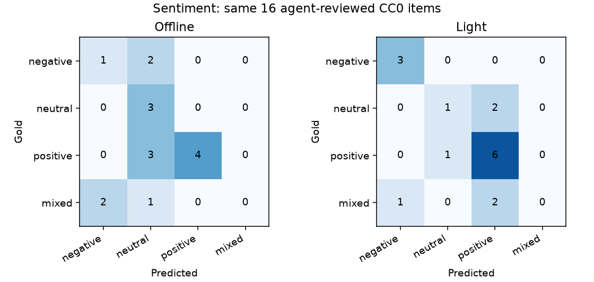

# Gold v2: Offline versus pretrained Light

Historical Gold v2 evidence is preserved below. Current independently human-reviewed
[Gold v3 CPU/GPU results](gold-v3-gpu.md), [reproduction](gold-v3-reproduce.md),
[validation ledger](gold-v3-validation.md).

Evaluation date: 2026-10-03. Application baseline:
`3c563a72a1c80fe50fe1fbdad25e69e8e7dfac0c`.
Branch: `eval/human-review-light-models`; no merge, rebase or release tag.

The existing pretrained Light stack ran locally on CPU. No model specification,
threshold, rule, prompt, taxonomy or weight was changed. Full was not run.
This evidence is suitable for demonstrating the project and discussing its errors;
it does not establish production accuracy or independent human-reviewed quality.

## Reviewed inputs and integrity

[Gold v2 review](../../ml/datasets/gold/ADJUDICATION-v2.md) covers every entity span/type,
topic, sentiment, event and supplied-candidate resolution target. It is **one agent's
semantic adjudication, not independent human adjudication**. Human sign-off remains
pending. The original provisional v1 and its reports remain intact.

The 16 original CC0 English samples retain their texts, IDs, 17 exact entity spans,
candidate sets, media references and coarse retrieval partners. Two decisions changed:
Metro Council's topic is consistently `politics.policy`; a museum exhibition is
`general`, not a company product launch. Typed event evidence decreases from 13 to 12.
The JSON review records three changed fields across those two decisions (event label
and extraction evidence express the same second decision). Ambiguities are retained
explicitly, including institutional/location names, policy intentions, mixed recovery
sentiment and the missing culture/exhibition event subtype.

[Manifest](../../ml/datasets/gold/manifest-v2.json) records exact file SHA-256, byte counts,
license, review method/date and annotation counts. Evaluation files use UTF-8/LF via
`.gitattributes`: Windows CRLF conversion otherwise made byte hashes differ on Linux.
Original v1 Git content was not changed. Performance reports retain their original
CRLF-checkout hash alongside the authoritative LF hash; their measured numbers did
not change. Quality reports additionally record the same validated Pydantic dataset
serialization hash for both profiles.

Labels were reviewed before new inference. The set is evaluation-only for this run:
no training, fine-tuning or threshold selection. Because v1 was previously used during
development, v2 is not an independent held-out corpus. No statistical significance or
inter-annotator agreement estimate is justified.

## Identical scoring

Both profiles used `aegis.intelligence.assessment.assess` against the same reviewed
file in the same optional environment, one quality pass each. Span NER requires exact
document/start/end; typed NER additionally requires semantic kind. Event extraction
requires exact document/type/evidence sentence. Event classification scores the
annotated summary separately and preserves event revision semantics.

Classification accuracy and macro F1 use the existing observed gold/prediction label
union, including abstention/unavailable labels. Sentiment keeps all four gold labels:
FinBERT has three output classes and no mixed class; no labels were collapsed to help it.
Resolution uses gold mentions and tiny supplied candidates independently of NER; its
top-3 measure includes correct abstentions. Retrieval excludes self, uses compatible
vectors and a stable document-ID tie-break, and scores the original one-partner
judgment with MRR and recall@3. Relevance is incomplete, not exhaustive semantic truth.

[Complete comparison table](evidence/comparison.md),
[Offline raw outputs](../../ml/evaluation/results/gold-v2-offline.json),
[Light raw outputs](../../ml/evaluation/results/gold-v2-light.json).

| Task | Offline | Light | Delta |
|---|---:|---:|---:|
| NER span F1 | 0.9697 | 0.9697 | 0.0000 |
| NER typed F1 | 0.0000 | 0.9697 | +0.9697 |
| Topic macro F1 | 0.6667 | 0.6667 | 0.0000 |
| Sentiment macro F1 | 0.3902 | 0.4908 | +0.1006 |
| Event extraction F1 | 0.8182 | 0.8182 | 0.0000 |
| Event classification macro F1 | 0.7714 | 0.7714 | 0.0000 |
| Resolution accuracy | 1.0000 | 1.0000 | 0.0000 |
| Retrieval MRR | 0.1987 | 0.8094 | +0.6107 |
| Retrieval recall@3 | 0.1875 | 0.8125 | +0.6250 |

Both NER profiles have span precision 1.000 and recall 0.941; Light typed scores are
identical to its span scores, while Offline emits `other`. Topics accuracy is 0.8125
for both. Sentiment accuracy is 0.500 versus 0.625. Event precision/recall are 0.900/0.750;
classification accuracy is 0.750. Resolution accuracy/top-3 are both 1.000 on 17 gold
mentions, including two unresolved cases. These perfect candidate scores are not
evidence of global entity-linking quality. Topics/events/resolution retain the same
baseline implementation in Light, so no pretrained improvement is expected there.

## Representative errors

| Task | Observed failure | Interpretation |
|---|---|---|
| NER false negative | Offline misses IBM; Light finds IBM but misses River Parliament | Equal aggregate span F1 hides different mistakes |
| NER type confusion | Offline labels every extracted organization `other` | Span detection is not semantic typing; no NER false positives were observed on this tiny set |
| Topics | Meridian Works becomes `business` instead of `business.earnings`; Reserve Council becomes `general` | Rule keyword gaps; no tuning performed |
| Sentiment | Orion Systems is mixed gold, Offline negative, Light positive | Failed trial plus launch/recovery is not represented by FinBERT's three-class output |
| Sentiment regression | Delta Bank and River Parliament are neutral gold but Light positive | Improved aggregate score does not mean every case improved |
| Event false positive/type confusion | City Museum exhibition becomes `company.product_launch` in both | The literal trigger `unveiled` does not establish a company product event |
| Event false negatives | Quarterly revenue surplus, reduced borrowing costs and halted grain deliveries are missed | Paraphrases absent from the frozen event rules |
| Resolution ambiguity | Metro Council has two identical names; IBM has no supplied candidate | Both correctly abstain; no observed resolution error in this restricted protocol |
| Retrieval miss | Light's Cedar District query prefers Beacon Network over Harbor Council | Recovery phrasing outranks the coarse regional partner; the relevance judgment is incomplete |

Light gets all three negative cases right versus Offline's one. It gets only one of
three neutral cases right versus Offline's three. Both miss all three mixed cases.
Light predicts six of seven positive cases correctly versus Offline's four. The figure
includes the mixed column even though neither profile emits it.

## Models and measured resources

Exact selected files, hashes, package versions and hardware are in the
[artifact receipt](../../ml/evaluation/results/gold-v2-light-artifacts.json).
Pinned revisions matched the existing configuration; no substitutions were needed.

| Model | Pinned revision | Selected snapshot payload |
|---|---|---:|
| dslim/bert-base-NER | `d1a3e8f13f8c3566299d95fcfc9a8d2382a9affc` | 434,391,621 bytes |
| ProsusAI/finbert | `4556d13015211d73dccd3fdd39d39232506f3e43` | 438,225,383 bytes |
| sentence-transformers/all-MiniLM-L6-v2 | `1110a243fdf4706b3f48f1d95db1a4f5529b4d41` | 91,607,178 bytes |

Total selected payload: 964,224,182 bytes (919.6 MiB). This is the measured logical
snapshot footprint, not network wire bytes, whole-cache size or allocated disk blocks.
Weights were explicitly fetched into the normal external Hugging Face cache; none are
committed. Downloads/install are excluded from inference and pipeline timing.

Upstream model cards describe [English BERT NER](https://huggingface.co/dslim/bert-base-NER),
[financial-domain three-class FinBERT](https://huggingface.co/ProsusAI/finbert) and
[384-dimensional MiniLM sentence embeddings](https://huggingface.co/sentence-transformers/all-MiniLM-L6-v2).
Their upstream published metrics are not used as AegisNews evaluation results.

Hardware: Windows 11 x86-64, Intel Core i9-14900HX, 24 physical cores/32 logical CPUs,
34,053,414,912 bytes RAM. Python 3.12.11; torch 2.14.1+cpu, transformers 4.57.6,
sentence-transformers 3.4.1, huggingface-hub 0.36.2, psutil 7.2.2. CPU profile defaults
were unchanged (24 PyTorch threads in the measured Light process). The available
RTX 4070 Laptop GPU (8188 MiB) was not used; the installed PyTorch build is CPU-only.
No GPU latency or VRAM allocation measurement is claimed.

| Profile | Cold first document | Load time including imports | Warm median / p95 | Sampled RSS peak | Throughput |
|---|---:|---|---:|---:|---:|
| Offline | 8.90 ms | No pretrained loader | 3.39 / 4.91 ms | 38.9 MiB | 281.23 docs/s |
| Light | 7867.04 ms | NER 6531.80 ms; sentiment 638.62 ms; embedding 261.56 ms | 142.11 / 173.14 ms | 1251.3 MiB | 7.01 docs/s |

Warm batch totals are 0.171 s Offline and 6.845 s Light for 48 document passes.
Each process starts with an empty model cache; the OS disk cache is not flushed.
Model load includes imports/config/tokenizer/weights and is separate from warm inference.
After the cold document, one full unmeasured dataset pass precedes three timed rounds.
Seven tasks include gold-mention resolution and summary classification, not storage or
Temporal. No tracemalloc is enabled in this dedicated benchmark. RSS is sampled every
20 ms, includes native allocations and is not guaranteed to capture the true peak.
After warmup RSS was 38.1 MiB Offline and 1212.0 MiB Light. Host background load is
uncontrolled; these short-document measurements cannot be extrapolated to long articles.
[Offline performance](../../ml/evaluation/results/gold-v2-offline-performance.json),
[Light performance](../../ml/evaluation/results/gold-v2-light-performance.json).

The common p95 helper previously selected rank 20 instead of rank 19 for 20 values.
A boundary regression failed before the nearest-rank correction and passed afterward.
This fixes measurement, not model quality; both profiles use the same corrected helper.
The existing Phase 6 n=5/n=48 results are unaffected and were not rewritten.

## Complete pipeline impact

The existing `NewsIngestionWorkflow` processed identical five-item CC0 demo batches
with an image, through raw MinIO storage, normalization, document/media links, all six
AI stages, immutable analysis persistence, derived records, signed provenance, encrypted
archive and API verification. Each batch uses new ingestion keys and retries those same
keys to prove no duplicate processing. All primary batches persisted 30 analyses.

| Workflow batch | Offline median / p95 | Light median / p95 |
|---|---:|---:|
| Cold worker/model cache, five concurrent items | 6.991 / 7.123 s | 16.458 / 16.575 s |
| Warm models, five concurrent items | 2.510 / 2.644 s | 2.612 / 2.707 s |

Warm batch wall including polling, verification and client/database overhead was
19.871 s Offline versus 19.899 s Light. This is not pure ingestion/inference throughput.
Temporal activity-start/completion timestamps measure actual stages; scheduling gaps
remain in total workflow time. With five items p95 is the maximum. The warm difference
is within uncontrolled host/container variability and does not establish a reliable
pipeline speed delta. Load time delays intelligence/completion; normalized documents
are committed before AI. Models run in independently retryable activities, never in
deterministic workflow code.

[Offline pipeline](../../ml/evaluation/results/gold-v2-offline-pipeline.json),
[Light pipeline](../../ml/evaluation/results/gold-v2-light-pipeline.json) include stage
distributions, documents, persisted exact pretrained revisions, duplicates and verification.
The evaluation topology uses the same optional local CPU worker environment for both
profiles with an isolated `aegis-eval` Docker API/PostgreSQL/Redis/MinIO/Temporal project.
It does not benchmark the dashboard/monitoring stack or a production deployment.

Initial measurements are retained separately (`*-pipeline-initial.json`). The first
runner accepted stale pollers; a PID-based correction then timed out because Windows
venv launchers create a child interpreter. The final runner instruments a unique SDK
client identity and waits for that exact poller before timing. A regression covers stale
pollers. No model behavior was changed to obtain the final measurements.

An additional empty-cache/network-disabled Light run completed ten fresh documents
across two batches, with valid provenance and stable duplicate retries. NER, sentiment
and embeddings reported `ModelUnavailable`; only baseline topics/events were persisted.
This [degraded-run diagnostic](../../ml/evaluation/results/gold-v2-light-unavailable-pipeline.json)
demonstrates that absent optional models do not prevent ingestion. It is excluded from
the pretrained quality/resource comparison.

## Limitations and next evidence

All 17 gold entities are organizations; typed NER scores do not establish person,
location or miscellaneous entity quality. The corpus is small, short, synthetic/CC0
and English-focused; it does not reflect the
real-world news distribution. Manual review is limited to one agent, with no independent
human sign-off. There is no large held-out corpus, longitudinal drift evaluation, GPU
comparison or Full-profile result. Sentiment intentions and institutional names remain
ambiguous; cultural events are not representable in the current specific taxonomy.

Use these tables, confusion counts and failure examples in the college presentation
with their limitations visible. Next: have a human reviewer sign off on v2 and annotate
a separate licensed held-out set. Do not fine-tune or optimize thresholds on this set.
Normal CI remains CPU/offline with no required models, GPU, paid API or credentials.
