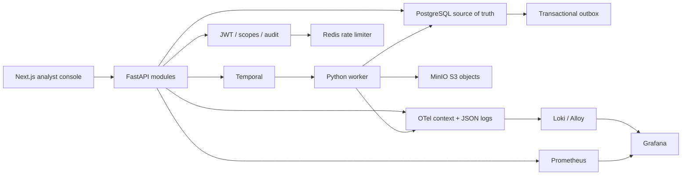
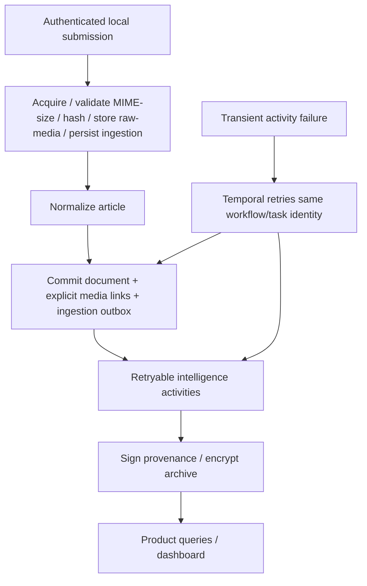
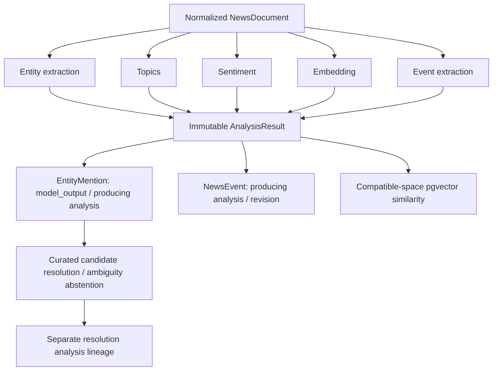
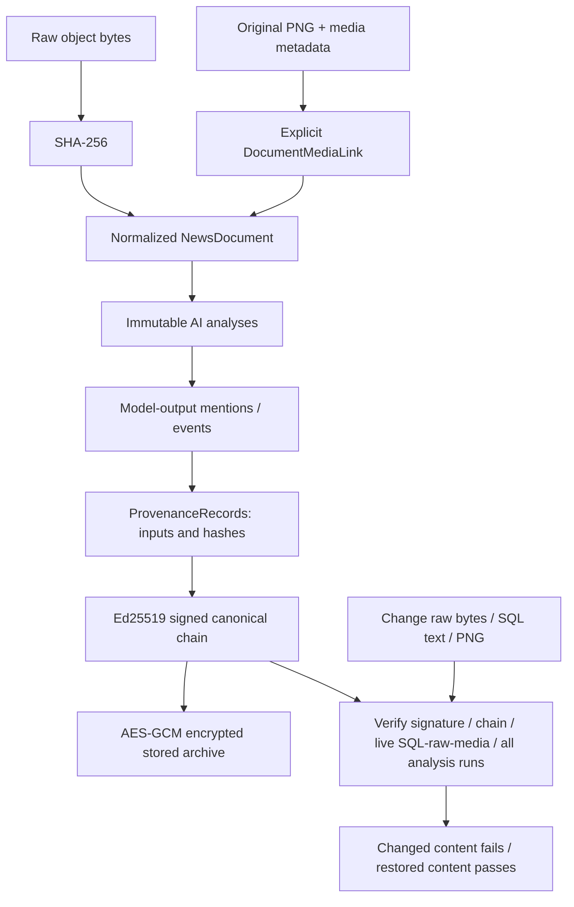
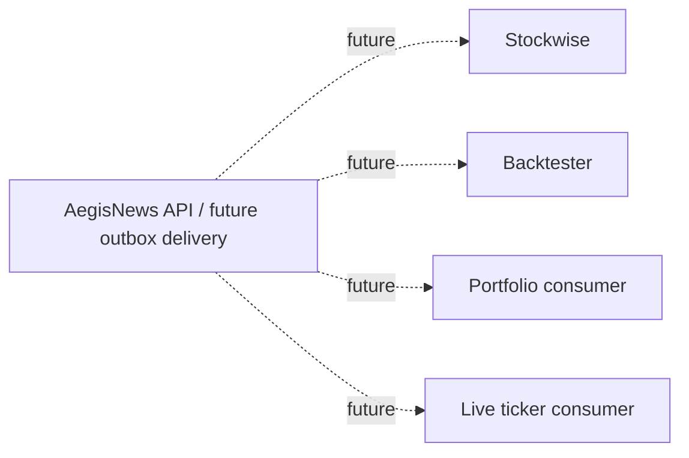

# Presentation architecture diagrams

Solid paths exist in the local prototype. The final diagram is explicitly future-only.

## System

## Ingestion and Temporal

## AI pipeline

## Provenance and tampering

The security demo verifies this live chain, changes controlled raw/SQL/image content,
observes failure, restores it and observes success. For a live UI window use
`python scripts/demo.py security --hold-tamper-seconds 25` and verify the seeded Atlas
article during/after the window. Graceful exceptions restore content; OS kills can
interrupt cleanup, in which case reset the isolated demo. See the [original PNG](../../data/samples/demo-image.png).

## Future consumers — not implemented

